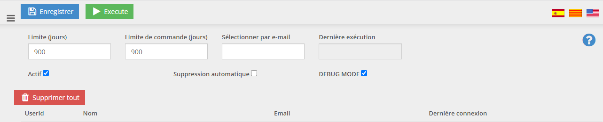

<link rel="stylesheet" href="https://www.w3schools.com/w3css/4/w3.css">
<link rel="stylesheet" href="https://www.w3schools.com/lib/w3-theme-blue.css">

<header class="w3-container w3-theme w3-padding" id="myHeader">
    <div class="w3-center">
        <h4>Make OpenStore GDPR complient</h4>
        <h1 class="w3-xxlarge">OpenStore GDPR</h1>
        <div class="w3-padding-32">
            <a href="https://www.openstore-ecommerce.com/" target="_blank" class="w3-btn w3-xlarge w3-dark-grey w3-hover-light-grey">OpenStore</a>
        </div>
    </div>
</header>

This plugin is designed to make OpenStore comply with European GDPR rules. European GDPR rules make retension and use of personal data restricted. Any personal data over 3 years, from an account that has not been active, should be removed from the database.  

### User/Account Personal Data

Any users which have not be active for a selected amount of time (900 days default) will be listed for removal. The manager will then be able to decide to remove all users or selected users from the system.  

NOTES:  
An option for automatic removal is available.  
If the user remove limit is < 60 days, the user remove limit will increased to 60 days.  

### Orders

Some installations of OpenStore do not have users. In these cases personal data is still linked to the Order. This plugin will mask any personal data of all orders after the retension time.  
If an Order needs to be removed becuase the client has demanded it to be removed, the manager can edit the order to remove the personal data.  

NOTES:  
Orders in OpenStore cannot be deleted by the UI, this is on purpose to ensure a history of orders is kept. The orders can be deleted from the DB by the website master.  

```
select * from [NBrightBuy] where XMLData.value('(genxml/billaddress/genxml/textbox/email)[1]','nvarchar(max)') like '%xxxx%'

begin tran
delete [NBrightBuy] where itemid = 1234
rollback / commit

```

### User Interface
The UI can be found in the Admin Panel of OpenStore.

Admin>GDPR

<div class="w3-row">
    <div class="w3-threequarter w3-padding">
        
        <table class="w3-table w3-padding">
            <tr>
                <td>Save Button</td>
                <td>Saves the UI settings.</td>
            </tr>
            <tr>
                <td>Execute Button</td>
                <td>Manually runs the selection of users to be removed.  If the scheduler has been setup the selection of users will run once a day.</td>
            </tr>
            <tr>
                <td>Active Checkbox</td>
                <td>Activate/Disactivate the execution of user selection.</td>
            </tr>
            <tr>
                <td>Auto remove Users Checkbox</td>
                <td>If the scheduler is activated, the users can be automatically removed from the system without manual interaction by a user.</td>
            </tr>
            <tr>
                <td>Remove Limit (Days)</td>
                <td>The number of days to search for inactive client.  The selection is based on the last login date.  GDPR requires a maximum of 3 years inactivity to retain personal data.  But this should be checked based on your business operations.</td>
            </tr>
            <tr>
                <td>Order Limit (Days)</td>
                <td>The number of days to search for orders that need the details removed.  This setting will be ignored by orders that have an attached client.  This setting is normally used for e-commerce websites that do not have registered users or where users have been deleted not using the OS_GDPR plugin.  </td>
            </tr>
            <tr>
                <td>Select User by Email</td>
                <td>
                    This option allows the manager to removed all personal data for a client, if they request it.  There is no time limit on this option.  If a client asked for removal of data, all data will be removed from what ever date.<br />
                    <b>NOTE: If an order is still being processed for a client, this option should NOT be used until the order has finished being processed.</b>
                </td>
            </tr>
            <tr>
                <td>Last Run</td>
                <td>The last time the selection of expired users was ran.</td>
            </tr>
            <tr>
                <td>Delete All Button</td>
                <td>Delete ALL selected user.</td>
            </tr>
            <tr>
                <td>Delete User Button</td>
                <td>Delete ONLY the user selected.</td>
            </tr>
        </table>
    </div>
</div>

### Debug Mode

Administrators can activate "DEBUG MODE". While in debug mode no users or orders will be updated or deleted.  
A log file is created in the "/Portals/_default/OS_GDPRLogs" folder.  

### Process Limit 500

The plugin will only process 500 users and order it 1 run. This is to stop the process from crashing te system. If more users or orders need to be removed, the process will need to be executed multiple time.  

### Scheduler

The OpenStore DNN scheduler can be setup to automaticaly run the expired user selection.  
[Scheduler Setup](https://doc.openstore-ecommerce.com/#11498)  
The scheduler will run the selected between 02:00 and 03:00 to minimise affects to the website.  If the auto removal option has been selected the scheduler must be setup for the clients to be removed.  

##### IMPORTANT: The OpenStore DNN scheduler MUST be active to process this data automatically.

Namespace: OpenStore.Providers.OS_GDPR.Scheduler  
Assembly: OS_GDPR

Admin > Extensions

  
  

### Administrator rights

Only the Administrator role can alter the retension limit for users and order. They can also put the system into debug mode.  
Administrators can also change the last run date.

### Methods of Execution

#### Fully Automatic

If the "Auto remove Users Checkbox" option is checked and the sceduler setup, the process will run every night and automatically remove users/orders that of over the retension time.  No need for human interaction to keep the system compliant to European GDPR.

#### Semi-Automatic

The Scheduler is setup and creates a list of users that should be removed.  Maual interaction via the UI list is required to remove the user.

#### Manual

A list of users that need to be removed is created when the "Execute Button" is clicked in the UI.  After that users can be removed via the UI.

